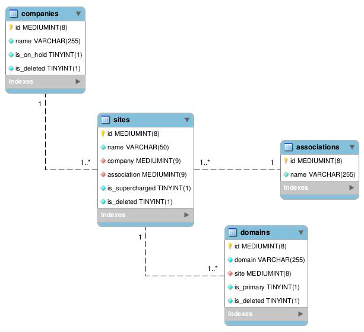

# exercises
These are personal exercises, challenges, and tests.

## Treehouse Marketing (Contractor Nation)

(2026 - JUL - 15)

### Challenge Brief: Treehouse reporting (SQL)

The UML diagram below shows some of the tables and relationships we deal with on a daily
basis. We have multiple companies as clients. Each of those companies can have multiple
sites, and each of those sites can have multiple domains. Sites belong to a single association.
A domain, site, or company is considered active if it’s not deleted or on hold, and doesn’t belong
to anything that is deleted or on hold.



_Please complete the following exercises and send back the queries used to generate
each list._

1. Provide a list (association name, company name, domain) of all active primary
supercharged domains belonging to the Basement Systems, Inc. association.
1. Provide a list (association name, company name, site name) of all active sites that do
not have a domain.
1. Provide a list (site id, site name) of distinct active sites who have one or more domain,
and whose domains are all deleted.

### Digging beyond the brief

- Schema has four tables: `companies` `sites` `domains` `associations`
- A company can own many sites. A site belongs to one company and one association. A site can have many domains.
- I think I'll be using inner join a lot.
- But that's not the hard part. It's actually correctly applying the inherited def. of "`active`".

```text
company
   └── site
         └── domain

association
   └── site
```
- instructions say that a domain, site, or company is active when it: Is not deleted. Is not on hold. Does not belong to something deleted or on hold.

### Answers

The answers are in files:
- `exer-01.sql`
- `exer-02.sql`
- and `exer-03.sql`

## Newsletter Signup and Subscriber Management DevChallenge

The demonstration for the Newsletter Signup and Subscriber list is on this directory of the branch: [**/treehouse-newslettersignup**](https://github.com/vince7488/exercises/tree/treehouse-marketing-cn/treehouse-newslettersignup)

- You can install locally and run `yarn dev`
- The brief was to use any of the three: React, Angular, Vue - I chose Vue3. (I think your site is in Vue2?)
- The site mimics the treehouse marketing theme.
- I added extras.

### Screens


---


---


---


---


---


---


